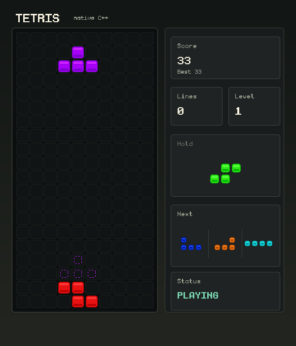
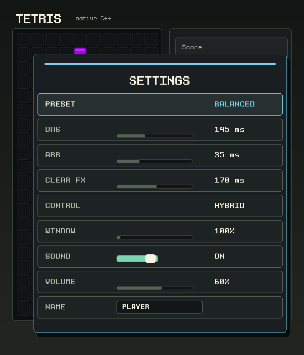

# C++ Tetris

A small Tetris game for Windows, written in C++ with the Win32 API. It has
hold, a ghost piece, a three-piece preview, and a local leaderboard to give
you a score to beat next time.



## Play on Windows

1. Open the [CI builds](https://github.com/huiishan99/game-cpp-tetris/actions/workflows/ci.yml)
   and choose a recent run with a successful Windows job.
2. Download **tetris-windows-x64** from the run's **Artifacts** section.
3. Extract the ZIP into a writable folder and run **main.exe**. Keep the
   **Font** folder beside it.

GitHub requires you to sign in to download artifacts, and each build expires
after 30 days. These are CI builds; there isn't a separate Releases download
yet. The downloadable build doesn't need a separate C++ runtime installation.

Select **START** and press Enter to play.

## Controls

These are the default controls. Hold a movement key to slide across the board.

| Action | Key |
| --- | --- |
| Move | Left / Right or A / D |
| Soft drop | Down or S |
| Hard drop | Space |
| Rotate clockwise | Up, W or X |
| Rotate counter-clockwise | Z |
| Hold | C or Shift |
| Pause / resume | P or Esc |
| Settings | F1 |
| Restart / quit during play | R / Q |

In the main and pause menus, use Up / Down or W / S to move and Enter or
Space to select the highlighted item. Use Esc or P to resume a paused game.
Esc quits from the main menu.

## A few things to try

- Save a piece with **hold** and use the ghost to line up your next drop
- Rotate near a wall or the stack: wall kicks and a short lock delay leave
  room for last-second adjustments
- Chain clears for combo and back-to-back bonuses, or try a T-spin. There
  are also custom spin-clear bonuses for L, J, I, S and Z pieces
- Beat your local top-five scores. Each 10 cleared lines raises the level
  and makes pieces fall faster

If your score makes the leaderboard, enter a name with 3–12 letters or digits
and press Enter. Esc saves it under your default player name.

## Make it feel right

Press **F1** to open settings. Start with **BEGINNER**, **BALANCED** or **FAST**,
or adjust **DAS** (the wait before a held key repeats) and **ARR** (the time
between repeats) yourself. You can also change the line-clear flash duration,
choose arrow keys, WASD or both, resize the window, adjust sound, and set your
player name.

Use Up / Down to choose a setting and Left / Right to change it. On **NAME**,
press Enter to edit, then Enter to save. Esc or F1 closes settings; while
editing a name, Esc cancels that edit first.

<details>
<summary>See the settings screen</summary>



</details>

Settings and scores stay local. The game saves `tetris_settings.txt`,
`tetris_highscore.txt` and `tetris_leaderboard.txt` in the folder you run it
from, so use a folder you can write to.

## Build from source

The game window is Windows-only. You'll need CMake 3.16 or newer and a C++17
compiler. For the build below, install Visual Studio or its Build Tools with
**Desktop development with C++**, then run these commands in PowerShell from
the project folder:

```powershell
cmake -S . -B build -A x64
cmake --build build --config Release
cmake --install build --config Release --prefix dist/tetris-windows-x64
cd dist/tetris-windows-x64
.\main.exe
```

The install step puts the executable, font and documentation together in
`dist/tetris-windows-x64`. Run from that folder so the font and local save
files are found in the right place.

If you already use MinGW-w64, `build.bat` builds `main.exe` in the project
folder using `g++` on your PATH. It can also use `cl` from a Visual Studio
Developer Command Prompt.

## Tests

The game rules can be tested on Windows, Linux and macOS without opening a
window. Run these from the project folder:

```sh
cmake -S . -B build
cmake --build build --config Release --target tetris_core_tests
ctest --test-dir build -C Release -R tetris_core_tests --output-on-failure
```

CI also checks the native Windows UI and runs a smoke test of the packaged
game. Its screenshots and reports are available in the
`tetris-windows-test-evidence` artifact alongside each Windows build.
